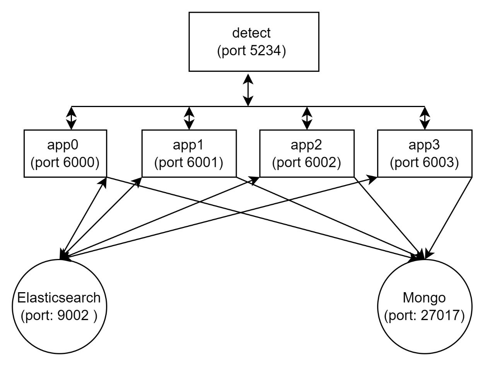

## Hướng dẫn cài đặt

## Diagram


## Cài driver 
```sh
sudo apt-get remove --purge '^nvidia-.*'
sudo apt-get remove --purge nvidia-settings
sudo apt-get remove --purge nvidia-prime
sudo apt-get autoremove
sudo apt-get autoclean
dpkg -l | grep nvidia
sudo apt-get update
sudo apt-get install nvidia-driver-<version>
```


## Cài elasticsearch, mongo, opencv for cuda , onnxruntime-gpu==1.19.0 
install.txt

## Thông tin package   
packages.txt 

## Thông tin thiết bị 
device.txt

## Code main 
  /main/detect.py 

## Code service 
  /main/app0.py 
  /main/app1.py
  /main/app2.py
  /main/app3.py


               
                                            


